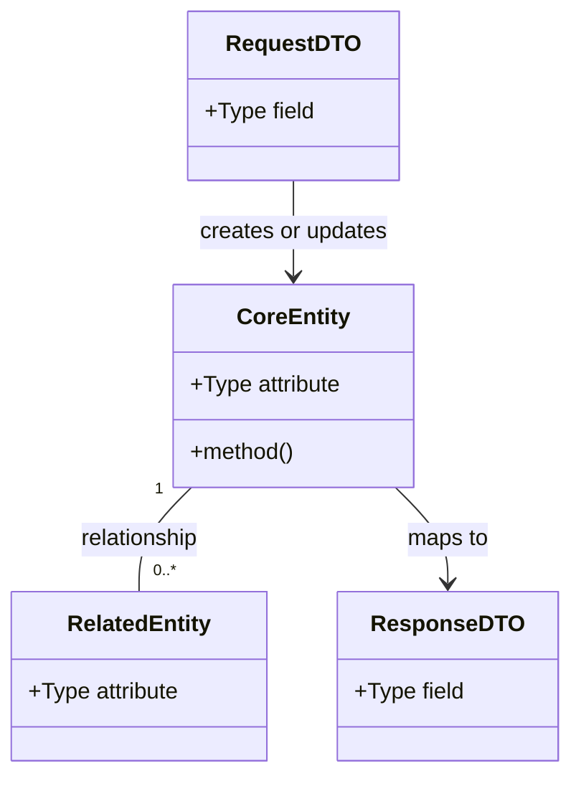

# <Derived Requirement Title>

Use this template as construction guidance for a complete REASONS Canvas prompt/spec artifact. A completed artifact should render as only the title and the seven REASONS sections below. The authoring guidance inside each section exists to help fill that section; do not preserve guidance labels unless they contain actual artifact content. Do not add lifecycle/state fields, approval metadata, generation timestamps, framework metadata, or routing instructions.

## Requirements

Objective: extract the essential problem, value, and boundary.

Output:
- One concise requirement statement in verb-phrase form.
- Key capabilities needed to satisfy the requirement.
- Scope boundaries, explicit non-goals, compatibility expectations, and acceptance signals.
- Requirement tensions or unresolved ambiguity, if any.

Construction guidance:
- Abstract the fundamental problem before listing features.
- Focus on business, user, product, or operational value before implementation.
- Make boundaries and constraints visible.
- Avoid feature stacking: do not turn this section into a task list.

Quality bar:
- The core requirement can be summarized in one sentence.
- The section explains why the change matters.
- The section is clear enough to judge whether later sections drift from the intent.

## Entities

Objective: model the domain and data objects the implementation must preserve or introduce.

Output:

Construction guidance:
- Identify core business entities, supporting entities, DTOs, records, events, and states.
- Show key attributes in type-plus-name form when the type matters.
- Show relationships, cardinality, ownership, and request-processing-response flow.
- Include interfaces or key methods only when they clarify the model.
- Prefer existing domain objects and data structures when they can satisfy the requirement.

Conservative constraints:
- Do not invent wrapper entities or abstractions unless the requirement forces them.
- Do not rebuild existing simple structures when extension is enough.
- Preserve backward compatibility for existing entities and contracts.
- Prefer gradual extension over broad restructuring.

Quality bar:
- The diagram covers the current task flow.
- Entity relationships are explicit and reviewable.
- The model avoids unnecessary complexity.

## Approach

Objective: define the solution strategy and the trade-offs behind it.

Output:
1. Solution strategy:
   - High-level approach.
   - Main architecture or design pattern, if any.
   - Key decisions and rationale.
2. Technical approach:
   - Framework, library, integration, persistence, API, or runtime choices.
   - Performance, security, reliability, and compatibility considerations.
   - Error-handling strategy.
3. Business logic:
   - Core business rules.
   - Validation strategy.
   - Workflow or lifecycle behavior.

Construction guidance:
- Organize by solution categories rather than file order.
- Explain why the chosen strategy fits the requirement and current system.
- Name rejected alternatives when the trade-off matters.
- Surface risks and assumptions instead of hiding them.

Quality bar:
- The approach is operable and testable.
- Key technical decisions have reasons.
- The section creates a clear bridge from requirements/entities to structure.

## Structure

Objective: define the system shape, component responsibilities, and dependency relationships.

Output:
### Ownership and boundaries
1. Component or module: responsibility and owner.
2. Interface, port, API, schema, or storage boundary: responsibility and caller.

### Dependencies
1. Component A may call or depend on Component B because <reason>.
2. Component C must not call or depend on Component D because <boundary>.

### Architecture shape
1. Entry point layer: responsibility.
2. Application/service layer: responsibility.
3. Domain layer: responsibility.
4. Infrastructure/integration/persistence layer: responsibility.
5. Error handling, validation, or policy layer: responsibility.

Construction guidance:
- Clarify inheritance, interface, implementation, and adapter relationships when relevant.
- Define dependency direction and forbidden shortcuts.
- Show where the change fits into the existing architecture.
- Preserve responsibility separation and existing extension points.

Quality bar:
- Ownership and dependency direction are unambiguous.
- The structure supports extension without unnecessary rewrites.
- Reviewers can detect misplaced code from this section.

## Operations

Objective: convert the abstract strategy into concrete, ordered, verifiable implementation work.

Output:
### Create/Update <ComponentType> - <ComponentName>
1. Responsibility: <clear responsibility>
2. Location: `<file/package/module if known>`
3. Attributes/configuration:
   - `<name>`: <type> - <meaning>
4. Methods/contracts:
   - `<methodName>(<parameters>): <ReturnType>`
   - Logic:
     1. <step>
     2. <branch or edge case>
     3. <error handling>
5. Dependencies: <required collaborators>
6. Constraints: <validation or business constraints>
7. Verification: <test/check/observable behavior>

Construction guidance:
- Base operations strictly on Requirements, Entities, Approach, and Structure.
- Group work by component or responsibility.
- Keep execution order explicit when dependencies exist.
- Make each operation single-responsibility and verifiable.
- Include method signatures, parameters, return types, and logic when the artifact is implementation-ready.
- If this artifact is intentionally earlier than implementation planning, mark unknowns explicitly instead of fabricating precision.

Quality bar:
- A capable implementer can execute the operations without rediscovering the whole problem.
- Each operation has clear completion evidence.
- The operation set covers the full requirement without widening scope.

## Norms

Objective: define reusable implementation standards and common patterns that must constrain the work.

Output:
1. Naming and organization standards.
2. Dependency injection, wiring, or composition patterns.
3. Error handling and response format standards.
4. Validation and input-handling standards.
5. Logging, observability, and diagnostics standards.
6. Testing standards.
7. Documentation and comment standards.

Construction guidance:
- Prefer repo-local conventions over generic best practices.
- Extract common patterns that should be reused across operations.
- Make norms concrete enough to check in review.
- Mark inferred norms when evidence is weak.

Quality bar:
- Norms are specific and executable.
- Norms improve consistency rather than adding ceremony.
- Reviewers can point to a violated norm.

## Safeguards

Objective: define hard constraints, quality gates, and forbidden outcomes.

Output:
1. Functional constraints: exact behavior that must or must not happen.
2. Performance constraints: measurable thresholds or known limits.
3. Security and privacy constraints: sensitive data, permission, or exposure boundaries.
4. Integration constraints: API, schema, protocol, migration, and compatibility limits.
5. Business-rule constraints: invariant business conditions.
6. Error-handling constraints: required error classes, messages, status codes, or redaction rules.
7. Technical constraints: forbidden imports, placements, dependencies, or runtime assumptions.
8. Data constraints: validation, persistence, serialization, or migration rules.
9. Review and rollback constraints: checks, approvals, rollback triggers, or stop conditions.

Construction guidance:
- State what cannot be compromised.
- Prefer verifiable constraints over vague warnings.
- Cover functional, technical, security, data, integration, and operational boundaries.
- Quantify thresholds when possible.
- If current evidence does not support implementation-ready detail, state the uncertainty in the relevant safeguard and name what evidence would resolve it.

Quality bar:
- Safeguards are clear, testable, and enforceable.
- The section prevents common AI overreach and silent drift.
- The implementation can be rejected for violating a listed safeguard.
