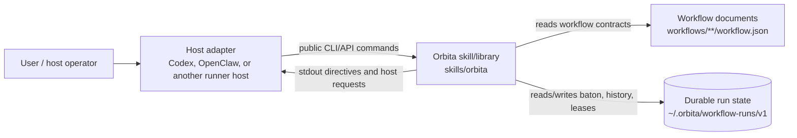
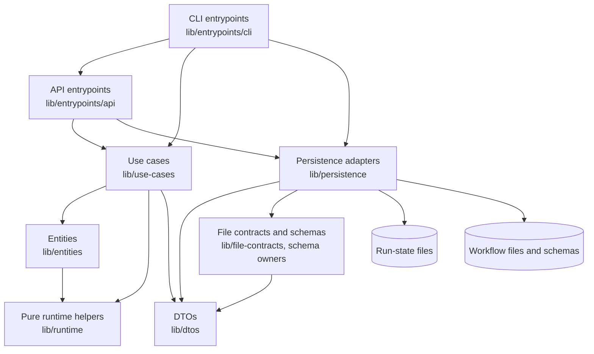
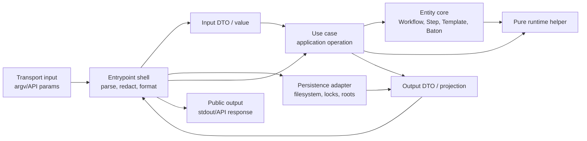

# Orbita Architecture

## Status

This file records the current intended architecture for `skills/orbita`.
It is a binding architecture contract for placement, dependencies, and review.
It is not a complete inventory of every module.

Orbita uses a clean-ish functional core with DTO boundaries and thin adapters:

```text
entrypoints -> use-cases -> entities/runtime
entrypoints -> persistence
persistence -> DTOs / records
use-cases -> DTOs + entities
entities -> pure runtime helpers only
```

The main rule is dependency direction. Business logic belongs in entities and
pure runtime helpers. IO belongs at the edges.

## C4 Views

### System Context



### Container View



`cli -> api` exists today for some commands, but it should not become the
default dependency pattern for new entrypoints. Prefer both adapters calling the
same use case or persistence adapter when the behavior is shared.

### Component View



The preferred component shape is value-in/value-out. Use cases should not need
to know which adapter loaded the values, and entities should not know that any
adapter exists.

## Layers

### DTOs

`lib/dtos/**` owns boundary data structures.

DTOs are data contracts between layers. They carry values into and out of use
cases, persistence, entrypoints, and tests. DTO modules must not perform IO,
read process state, parse CLI arguments, access files, call runner commands, or
own business decisions.

### Entities

`lib/entities/**` is the core business logic layer.

Entities own workflow-domain rules and invariants such as workflow validation,
step transition behavior, prompt/template behavior, baton state rules, artifact
metadata rules, and schema-owned domain constraints.

Entity code must stay independent of filesystem, CLI, API, process state,
runner command execution, host adapters, locks, leases, and persistence roots.
Entities receive DTOs or plain value objects and return DTOs, values, or errors.

Entity owner directories are independent. `Workflow`, `Step`, `Template`, and
`Baton` must not import each other directly. Shared pure behavior belongs in
`lib/runtime/**` or another explicitly owned pure helper, not in another entity
owner.

### Runtime Helpers

`lib/runtime/**` owns pure shared runtime helpers used by entities and use cases.

Runtime helpers may contain parsing, normalization, selection, transition, and
prompt-rendering support when those operations are deterministic and IO-free.
They are not a place for filesystem access, command execution, host lifecycle,
lease handling, or persistence policy.

### Use Cases

`lib/use-cases/**` is the application flow layer.

Use cases accept DTOs/plain values, call entities and pure runtime helpers, and
return DTOs/projections/results. They compose entity behavior into one
application operation such as validation, rendering next workflow work, applying
accepted output, continuing a run, or loading instructions.

Use cases must not parse CLI arguments, read/write files directly, inspect
process environment, own run locks, or know host worker lifecycle details.
Those responsibilities belong to entrypoints and persistence.

Top-level use cases should not import other top-level use cases. Shared behavior
between use cases belongs under a local internal helper folder such as
`lib/use-cases/runtime/**`, or in a pure runtime/entity helper when that is the
true owner.

Current drift: `lib/use-cases/ContinueRun.mjs` imports
`lib/use-cases/ApplyWorkflowOutput.mjs`. Treat this as a migration item, not as
approved architecture. Either keep it as an explicit temporary exception or move
the shared flow into an internal helper before enforcing the rule mechanically.

### Persistence

`lib/persistence/**` is the filesystem adapter layer.

Persistence owns reading and writing workflow resources, run-state files,
atomic writes, durable commits, locks, leases, run indexes, path safety, and
workflow-run root migration. Persistence accepts DTOs/records/plain values and
returns DTOs/records/plain values.

Persistence must not import use cases. It must not own business decisions that
belong in entities or use cases. `lib/persistence/run-state/**` has additional
local rules in `lib/persistence/run-state/CONTEXT.md`.

### Entrypoints

`lib/entrypoints/**` is the adapter/shell layer.

Entrypoints parse external input, validate transport-level arguments, call use
cases and persistence adapters, format public output, and redact public errors.
CLI and API entrypoints may coordinate IO, leases, locks, persistence reads, and
response formatting, but they must not become the owner of workflow-domain
business logic.

`lib/entrypoints/api/workflowRunner.mjs` is currently the main composition shell
for the public runner API. That is acceptable only while its branching remains
about IO orchestration, current-request validation, persistence coordination,
lease authority, and public response construction. If workflow-domain rules
accumulate there, move them back into use cases/entities.

### File Contracts And Schemas

`lib/file-contracts/**`, entity schemas, runtime output schemas, run-state
schemas, and workflow-local schemas own explicit file and JSON contracts.

Schema modules may validate data shape and schema-owned constraints. They are
not a substitute for entity behavior when the rule is a workflow-domain
invariant.

## Dependency Rules

Binding rules:

- `entities/**` must not import `persistence/**` or `entrypoints/**`.
- Entity owner directories must not import other entity owner directories.
- `use-cases/**` must not import `entrypoints/**`.
- `use-cases/**` must not perform filesystem, CLI, process, or host-worker IO.
- Top-level use cases should not import other top-level use cases.
- `persistence/**` must not import `use-cases/**`.
- `persistence/run-state/**` must not import DTOs; projection belongs at the
  entrypoint/use-case boundary.
- `entrypoints/**` may depend inward on use cases and sideways on persistence,
  but must not become the owner of entity rules.
- Host-specific adapter concepts such as Codex/OpenClaw worker lifecycle must
  not leak into entities, pure runtime helpers, or use-case output schemas.

The current mechanical boundary guard is
`scripts/check-workflow-runtime-boundaries.mjs`. New architecture rules should be
added there when they can be checked reliably.

## Current Architecture Research

This section records the current codebase deviations from the intended
architecture. These are not approved shapes; they are migration targets.

### Use-case-to-use-case imports

Top-level use cases currently import other top-level use-case modules:

- `lib/use-cases/ContinueRun.mjs` imports
  `lib/use-cases/ApplyWorkflowOutput.mjs`.
- `lib/use-cases/LoadInstructions.mjs` imports
  `lib/use-cases/workflow-semantic-validation.mjs`.
- `lib/use-cases/ValidateWorkflow.mjs` imports
  `lib/use-cases/workflow-semantic-validation.mjs`.

`workflow-semantic-validation.mjs` behaves like shared validation policy, not a
standalone application operation. Move shared behavior under an internal helper
owner before adding a hard no-cross-use-case check.

### Use-case runtime reaches persistence and filesystem

`lib/use-cases/runtime/output/output-schema-validation.mjs` imports
`lib/persistence/workflow-resources/output-schema-loader.mjs` and also uses
filesystem APIs for artifact path boundary validation.

This mixes pure validation with adapter concerns. The target shape is:

- persistence resolves/loads schemas and filesystem path facts;
- use-case/runtime validation receives already loaded schemas and explicit path
  values;
- artifact path safety remains deterministic over supplied paths, with any
  realpath/symlink probing isolated behind persistence or an adapter helper.

### API shell reaches into use-case internals

`lib/entrypoints/api/workflowRunner.mjs` imports top-level use cases, which is
expected, but it also imports internal use-case runtime modules such as
`use-cases/runtime/output/output-schema-validation.mjs`,
`use-cases/runtime/output/history-projection.mjs`, and
`use-cases/runtime/output/worker-output-schema.mjs`.

That makes the API shell depend on implementation details of the use-case
layer. The target shape is a smaller use-case-facing API: entrypoints call
named use cases, and use cases own their internal output/history validation.

### Persistence imports Baton schema

`lib/persistence/workflow-resources/runtime-reader.mjs`,
`lib/persistence/run-state/persisted-state-schema.mjs`, and
`lib/persistence/run-state/schema/runner-host-response-schema.mjs` import Baton
schema material from `lib/entities/Baton`.

This is schema coupling, not entity behavior coupling, but it is still a
boundary to watch. If the DTO-only persistence rule becomes strict, move the
durable Baton schema contract to a file-contract/schema owner that both entity
and persistence code can depend on without making persistence depend on an
entity owner.

### Cross-entrypoint dependency

`lib/entrypoints/cli/validate-workflow.mjs` imports
`lib/entrypoints/api/validateWorkflow.mjs`.

This is acceptable as a temporary adapter reuse shortcut, but new shared
behavior should live behind use cases or persistence adapters rather than one
entrypoint importing another entrypoint.

### Legacy compatibility entrypoints

`lib/entrypoints/cli/start-run.mjs`,
`lib/entrypoints/cli/persist-run-state.mjs`, and
`lib/entrypoints/cli/workflow-interpreter.mjs` are transitional/legacy surfaces.
They may keep narrower exceptions while compatibility requires them, but new
architecture should route through the current `workflow-runner` and
`workflow-runs` surfaces.

## Public Runner Contract

The public runner contract is an adapter boundary, not the center of the domain
model.

Stable public rules:

- Latest `workflow-runner next` / `continue --only-instructions` stdout is the
  active directive.
- `workflow-runner write-output` accepts or rejects one current host request
  output. It is not navigation.
- `workflow-runner continue` navigates only after current request outputs have
  already been accepted.
- `workflow-runner instructions` returns compiled instructions for the current
  requested step and does not accept `--only-instructions`.
- `workflow-runner bind-agent` writes advisory worker binding metadata only; it
  must not turn worker output into host lifecycle state.
- Host requests are public projections. Durable state remains baton plus
  history plus explicitly owned runner metadata.

The detailed host-adapter boundary lives in
`lib/docs/workflow-runtime-adapter.md`. Do not duplicate its command details here
unless this architecture contract changes.

## Durable Run State

The default durable run-state root is `~/.orbita/workflow-runs/v1`, configurable
with `ORBITA_HOME` and overridable with `WORKFLOW_RUNS_ROOT`.

Legacy skill-local `skills/orbita/.workflow-runs` is not an active normal root.
Migration from the legacy root is guarded and must not silently merge two
non-empty roots.

Run-state ownership, history rules, leases, locks, and private-state boundaries
are local to `lib/persistence/run-state/**` and are documented in
`lib/persistence/run-state/CONTEXT.md`.

## Review Gates

Architecture-sensitive Orbita changes should answer these questions before
implementation is accepted:

- Does the change place business logic in entities or pure runtime helpers?
- Does the use case still receive DTOs/plain values and return DTOs/projections?
- Did entrypoints stay thin, or did they gain workflow-domain decisions?
- Did persistence stay a filesystem adapter over DTOs/records?
- Did any layer import against the dependency rules above?
- Did any host adapter concept leak into entities/use cases?
- Did public runner behavior change, and if so did
  `lib/docs/workflow-runtime-adapter.md` and tests change with it?
- Did durable state behavior change, and if so did
  `lib/persistence/run-state/CONTEXT.md` and tests change with it?

Minimum checks for normal changes:

```sh
npm run workflow-runtime-boundaries:check
make -C skills/orbita test
npm run workflow:validate
```

Run `npm run validate` when the environment permits the broader check stack.

## Migration Items

- Decide whether `ContinueRun.mjs -> ApplyWorkflowOutput.mjs` remains an
  explicit temporary exception or should move through an internal helper so
  top-level use cases stop importing other top-level use cases.
- Move shared workflow semantic validation out of top-level use-case namespace
  or explicitly classify it as an internal helper.
- Split `output-schema-validation.mjs` so use-case/runtime validation no longer
  imports persistence or performs direct filesystem probing.
- Hide use-case runtime internals behind named use-case APIs so
  `entrypoints/api/workflowRunner.mjs` stops importing internal output/history
  helpers directly.
- Decide whether Baton schema imports from persistence remain a schema-only
  exception or move the durable schema contract under a neutral file-contract
  owner.
- Replace cross-entrypoint reuse with shared use-case/persistence calls where it
  is worth changing.
- Add a mechanical boundary check for top-level use-case imports once the
  exception above is resolved or explicitly allowlisted.
- Add local `CONTEXT.md` files for `lib/entities`, `lib/use-cases`,
  `lib/entrypoints`, `lib/persistence`, and `lib/dtos` when the rules here need
  folder-local ownership detail.
