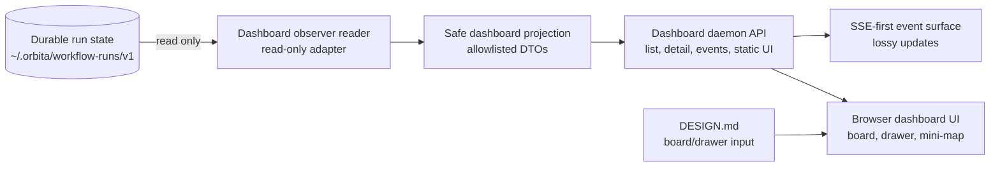

# Orbita Architecture

## Scope

This document is the architecture contract for the Orbita workflow-runner
runtime. It records layer ownership, dependency direction, retired surfaces,
conditional helper/schema zones, and review gates for issue #194.

This contract covers `skills/orbita/**`. It does not define the dashboard visual
design; that remains in `DESIGN.md`.

## Supported Runtime Surface

The canonical workflow-runner command surface is:

- `next`
- `instructions`
- `write-output`
- `continue`
- `bind-agent`

Validation and persistence behavior that supports these commands belongs to the
current runtime architecture. Obsolete backward-compatibility surfaces do not.

Retired surfaces:

- `start-run`
- `persist-run-state`
- `workflow-interpreter`
- legacy command aliases
- compatibility wrappers whose only purpose is preserving obsolete paths

Retired surfaces must not remain in supported command paths, exports, docs, or
boundary-check allow lists.

## Layer Ownership

### Entrypoints

Owner: `lib/entrypoints/**`

Entrypoints are transport shells. They parse CLI/API input, coordinate IO with
persistence adapters, acquire or pass through leases where needed, call named
use-case APIs, and format public output.

Entrypoints may depend on:

- named use-case APIs
- persistence adapters
- DTOs, request/response records, and transport-local schemas

Entrypoints must not depend on:

- `lib/use-cases/runtime/**` internals for stable behavior
- sibling entrypoint shells, including CLI-to-API imports
- entity internals except through approved use-case or DTO boundaries

### Use Cases

Owner: `lib/use-cases/**`

Use cases own application flow over DTOs and plain values. They call entity
owners and IO-free runtime helpers, then return DTOs, projections, or command
results to entrypoints.

Top-level use cases must not import other top-level use cases as a stable
pattern. Shared application policy belongs in a colocated helper or an internal
use-case helper zone only when multiple use cases need the same policy.

`ContinueRun -> ApplyWorkflowOutput` is a migration target, not an approved
compatibility exception.

### Entities

Owner: `lib/entities/**`

Entities own workflow-domain invariants and behavior for concepts such as
Workflow, Step, Template, and Baton. Entities are IO-free and owner-isolated.

Entities must not import:

- persistence
- entrypoints
- filesystem/path APIs
- unrelated entity owner internals

`entities/Baton` owns Baton behavior. A durable Baton schema shared by multiple
layers is a file contract, not an entity behavior dependency for persistence.

### Runtime Helpers

Owner: `lib/use-cases/runtime/**`

Runtime helpers are deterministic and IO-free. They operate over supplied
values, entities, DTOs, and supplied schema/path facts.

Runtime helpers must not import:

- `node:fs`
- `node:path`
- persistence modules
- workflow-resource loaders

Output validation in runtime helpers consumes loaded schemas and explicit path
facts. Schema loading, realpath probing, symlink checks, and artifact path facts
belong to adapters or file-contract owners.

### Persistence

Owner: `lib/persistence/**`

Persistence owns filesystem and durable-state integration:

- workflow resource loading
- run-state records
- locks and leases
- durable commits
- run indexes
- path safety facts
- current migration behavior
- schema loading for persisted/file records

Persistence may depend on DTOs, records, and file contracts. Persistence must
not import use cases.

Persistence must not import entity-owned Baton schema after the schema has a
neutral or narrowly colocated file-contract owner.

### File Contracts And Schemas

Owner: a neutral contract zone or a narrow colocated owner, selected by deletion
proof.

Use a separate file-contract/schema zone only when a durable schema is consumed
by multiple layers or when separating it prevents recurring schema/domain
ownership drift. If one narrow owner is enough, colocate the contract with that
owner.

A file-contract/schema zone must own real contracts, not act as a dumping ground
for constants or pass-through wrappers.

### Boundary Checks

Owner: `scripts/check-workflow-runtime-boundaries.mjs`

Boundary checks enforce resolved architecture rules. They should fail recurrence
of forbidden imports and retired surfaces, while avoiding hard failures for
questions that are still unresolved by the architecture contract.

Checks should cover:

- entrypoints importing runtime internals
- CLI entrypoints importing API entrypoints
- runtime helpers importing filesystem/path/persistence
- persistence importing use cases
- persistence importing entity-owned Baton schema after migration
- top-level use-case-to-use-case imports
- retired legacy surfaces exposed as supported commands, exports, docs, or
  allow-list entries

## Conditional Zones

`lib/file-contracts/**` and `lib/use-cases/internal/**` are conditional zones.
They are allowed only when they own shared policy or durable contract behavior
that survives the deletion test.

Deletion test:

- If deleting the zone only removes folder structure and no caller complexity
  returns, the zone is folder theater and should be removed.
- If deleting the zone pushes shared policy or contract handling back into
  multiple callers or wrong layers, the zone is earning its boundary.

Default to colocation for a single narrow helper or schema.

## Runtime Flow

A canonical workflow-runner command enters through a CLI or API entrypoint. The
entrypoint parses input, coordinates persistence and lease concerns where
needed, and calls a named use-case API.

The use case performs application flow over DTOs/plain values, entity behavior,
IO-free runtime helpers, and supplied contracts. Persistence loads workflow
resources, schemas, run-state records, leases, and path facts, then passes plain
values or contracts across the boundary.

Entrypoints format current public output and errors. They do not reach into
runtime helper internals to assemble behavior.

## Dashboard Observer Architecture

The Orbita dashboard is a read-only observation surface over durable
`workflow-runner` run state. It extends the adapter side of Orbita; it does not
join the runner control protocol and does not become another host adapter.

`skills/orbita/DESIGN.md` is the product/design input for the board, card,
drawer, lane, mini-map, and no-control UI rules. This architecture section owns
the backend/UI boundary that makes those design rules safe.

Target shape:

```text
run-state files -> observer reader -> safe projection -> dashboard API/events -> browser UI
```

Intended source zones:

- `lib/dashboard/server/**` owns the local daemon/API shell, static UI serving,
  SSE event stream, file-watch or polling loop, restart rebuild, and degraded
  read isolation.
- `lib/dashboard/projection/**` owns safe dashboard read models, lane
  classification, history excerpt policy, workflow mini-map projection, and
  redaction policy.
- `lib/dashboard/contracts/**` owns browser-visible DTO schemas and examples
  for list, detail, event, degraded diagnostic, artifact summary, cursor chip,
  and mini-map surfaces.
- `lib/dashboard/ui/**` owns browser rendering against those DTOs only.

If these zones become substantial, add `lib/dashboard/CONTEXT.md` in the same
slice to record local ownership and forbidden dependencies. Do not create that
context file for a placeholder-only or documentation-only change.

### Dashboard Bounded Contexts

Dashboard backend is an observer-owned adapter context. It may read durable
workflow-runner state through persistence/run-state adapters or explicit
read-only filesystem adapters, then project the result into dashboard DTOs. It
must isolate per-run read/parse failures as degraded dashboard records and must
not persist those degraded records into workflow state.

Dashboard projection is a read-model context. It owns allowlisted DTOs and
classification policy for `Waiting for user`, `Worker running`, `Blocked`,
`Degraded`, and `Done`. It may expose bounded, redacted history excerpts and
artifact metadata, but it must not expose raw baton, raw history, compiled
instructions, private prompts, token-bearing commands, hidden transcripts,
instruction storage paths, preferred worker agent ids, bind-agent commands, or
unnecessary host control-plane metadata.

Dashboard UI is a browser-only inspection context. It consumes safe DTOs from
the daemon API/event surface and follows `DESIGN.md`. It must not read
`~/.orbita` directly, infer runner state from filesystem paths, include
drag/drop movement, or show controls that resemble `next`, `continue`,
`write-output`, `bind-agent`, retry, repair, or manual lane movement.

### Dashboard Relationships



The dashboard daemon may rebuild projections by rereading durable state after
restart or watcher loss. Event delivery is lossy and observational: SSE/poll
recovery must never create backpressure into workflow execution, hold run
leases, or delay `workflow-runner` control commands.

### Dashboard Dependency Rules

Binding rules for dashboard code:

- `lib/dashboard/**` must not import runner mutation/control entrypoints, CLI
  command builders, lease authority, write-output/continue/next/bind-agent
  handlers, or host worker lifecycle code.
- Browser UI code must depend only on dashboard DTO contracts and browser
  platform APIs; it must not import persistence, filesystem helpers,
  workflow-runner API shells, or Node-only modules.
- Projection code may depend on DTO/schema/value helpers and read-only records,
  but must not depend on CLI argument parsing, process environment, locks,
  leases, or mutation use cases.
- Dashboard server code may coordinate read-only IO and response formatting, but
  workflow-domain decisions still belong in existing entities/use cases and
  dashboard-specific display decisions belong in projection.
- Dashboard artifacts, degraded diagnostics, bounded history excerpts, cursor
  chips, and mini-map data are projections. They are not durable workflow state
  and must not be written back into run directories.

Add mechanical boundary checks for these rules when dashboard code is added.
At minimum, tests/checks must prove absence of lease tokens, token-bearing
commands, raw instruction commands, private prompts, hidden transcripts, raw
instruction paths, preferred agent ids, bind-agent commands, and unnecessary
host control-plane metadata in browser-visible DTOs.

## Dependency Rules

Allowed:

- `entrypoints -> use-cases`
- `entrypoints -> persistence`
- `use-cases -> entities`
- `use-cases -> runtime helpers`
- `use-cases -> file contracts`
- `runtime helpers -> entities`
- `runtime helpers -> file contracts`
- `persistence -> DTOs/records/file contracts`

Forbidden:

- `entrypoints -> use-cases/runtime/**`
- `entrypoints/cli -> entrypoints/api`
- `use-cases/<top-level> -> use-cases/<top-level>`
- `use-cases/runtime -> node:fs`
- `use-cases/runtime -> node:path`
- `use-cases/runtime -> persistence`
- `persistence -> use-cases`
- `persistence -> entities/Baton/schema/**` after schema ownership migration
- supported command paths or exports for retired legacy surfaces
- dashboard code mutating run state, acquiring leases, invoking runner
  navigation/output commands, or exposing private runner control data through
  browser-visible DTOs

## Review Gates

Architecture review must verify:

- the changed source still reveals the layer model
- retired surfaces are absent from supported paths
- no new compatibility wrapper is introduced under a different name
- helper/schema zones are colocated unless shared ownership pressure is proven
- docs, checks, and source agree on supported command surface and dependency
  rules
- dashboard changes preserve the read-only observer boundary, safe projection
  layer, SSE/poll recovery behavior, degraded per-run isolation, and
  `DESIGN.md` board/drawer/no-control contract
- dashboard tests or boundary checks prove browser DTOs exclude private
  runner/control fields and dashboard code does not import or call runner
  mutation/control surfaces

Backend review must verify:

- canonical `next`, `instructions`, `write-output`, `continue`, and
  `bind-agent` behavior remains coherent
- output validation, artifact metadata handling, run-state persistence, leases,
  history, and current migration semantics did not change accidentally
- imports obey the dependency rules above

QA/reliability review must verify:

- focused workflow-runner checks cover canonical command behavior
- boundary checks fail resolved forbidden imports and retired-surface exposure
- retired legacy names are absent from supported command paths, exports, docs,
  and allow lists

Security and privacy review must verify:

- artifact path handling remains constrained to approved run artifact
  directories
- run-state, lease, history, and output records do not expose new private data
  surfaces while ownership moves

## Non-Goals

- Preserve backward compatibility for obsolete legacy entrypoints, aliases, or
  wrappers.
- Redesign the current public workflow-runner protocol beyond removing obsolete
  surfaces from supported architecture.
- Change host lifecycle semantics for the canonical current runner surface.
- Keep `start-run`, `persist-run-state`, or `workflow-interpreter` as temporary
  exceptions.
- Add broad framework seams where a narrow colocated helper or named use-case
  API is enough.
- Add brittle boundary rules for ownership questions that remain unresolved.
